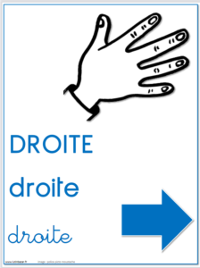

# TOTAL PERSPECTIVE VORTEX

Le but de ce projet est d'entrainer un modèle de machine learning à faire des predictions à partir de données d'EEG: **Electro-encéphalogramme**.\
Il s'agit de prédire à partir de ces données, à quel mouvement (A ou B) la personne est en train de penser.

|||
|--|--|
|||

## General instructions:
You’ll have to process data coming from cerebral activity, with machine learning algo-
rithms.

The data was mesured during a motor imagery experiment, where people had to
do or imagine a hand or feet movement. Those people were told to think or do a move-
ment corresponding to a symbol displayed on screen. The results are cerebral signals
with labels indicating moments where the subject had to perform a certain task.

You’ll have to code in Python as it provides **MNE**, a library specialized in **EEG** data
processing and, scikit-learn, a library specialized in machine learning.\
The subject focuses on implementing the algorithm of dimensionality reduction, to
further transform filtered data before classification.\
This algorithm will have to be in-
tegrated within **sklearn** so you’ll be able to use sklearn tools for classification and score validation.

